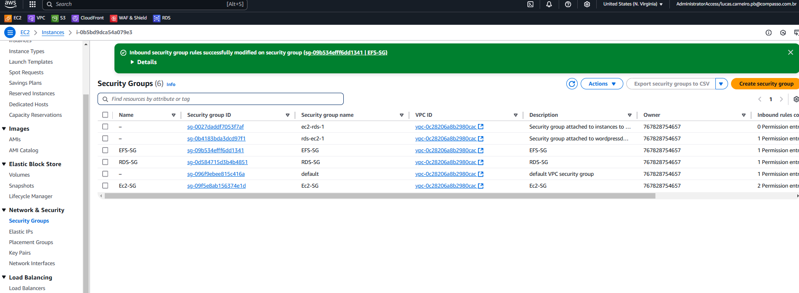

# Documentação do Projeto: WordPress com Docker, AWS EC2, RDS e VPC

Este projeto consiste na implantação de um site WordPress utilizando **Docker** em uma instância **EC2** da AWS, com um banco de dados gerenciado pelo **Amazon RDS** (MySQL) e uma rede isolada configurada com **VPC**. Abaixo, você encontrará um guia detalhado de todas as etapas realizadas, incluindo o uso do **Subnet Calculator** para planejamento de redes e a configuração de **Security Groups** para garantir a segurança da infraestrutura.


---

## Tecnologias Utilizadas

- **AWS (Amazon Web Services)**: Plataforma de computação em nuvem.
  - **EC2**: Serviço de máquinas virtuais.
  - **RDS**: Serviço de banco de dados gerenciado.
  - **VPC**: Rede privada virtual.
  - **EFS**: Sistema de arquivos elástico (opcional).
  - **Security Groups**: Firewall virtual para controlar o tráfego de rede.
- **Docker**: Plataforma de contêineres para empacotar e executar aplicações.
- **Docker Compose**: Ferramenta para definir e executar aplicações multi-contêiner.
- **MySQL**: Banco de dados relacional usado pelo WordPress.
- **Subnet Calculator**: Ferramenta para calcular e planejar sub-redes em uma VPC.

---

## Passo a Passo do Projeto

### 1. Criação da VPC (Virtual Private Cloud)

A VPC é uma rede privada virtual onde todos os recursos da AWS serão executados de forma isolada.

1. **Criar a VPC**:
   - No Console da AWS, acesse o serviço **VPC**.
   - Clique em **"Create VPC"**.
   - Defina o bloco CIDR (ex: `10.0.0.0/16`).
   - Nomeie a VPC (ex: `MinhaVPC`).


2. **Criar Sub-redes**:
   - Use o **Subnet Calculator** para planejar as sub-redes.
     - **Link do Subnet Calculator**: [Subnet Calculator](https://www.davidc.net/sites/default/subnets/subnets.html)
     - Essa ferramenta ajuda a dividir o bloco CIDR da VPC em sub-redes menores (ex: `10.0.1.0/24` e `10.0.2.0/24`).
   - Crie duas sub-redes em zonas de disponibilidade diferentes (ex: `us-east-1a` e `us-east-1b`).


3. **Criar um Internet Gateway**:
   - Anexe um Internet Gateway à VPC para permitir acesso à internet.


4. **Configurar a Tabela de Rotas**:
   - Associe as sub-redes à tabela de rotas e adicione uma rota para o Internet Gateway (`0.0.0.0/0`).


---

### 2. Criação dos Security Groups

Os **Security Groups** atuam como firewalls virtuais, controlando o tráfego de entrada e saída para os recursos da AWS.

1. **Security Group para a Instância EC2**:
   - No Console da AWS, acesse o serviço **EC2**.
   - No menu à esquerda, clique em **"Security Groups"**.
   - Clique em **"Create security group"**.
   - Defina um nome (ex: `SG-EC2-WordPress`) e uma descrição.
   - Adicione as seguintes regras de entrada:
     - **SSH (Porta 22)**: Permitir tráfego de seu IP pessoal para administração.
     - **HTTP (Porta 80)**: Permitir tráfego de qualquer IP para acesso ao WordPress.
     - **HTTPS (Porta 443)**: Permitir tráfego de qualquer IP para acesso seguro ao WordPress.
   - Deixe as regras de saída padrão (permitir todo o tráfego de saída).

2. **Security Group para o RDS**:
   - Crie outro Security Group para o RDS (ex: `SG-RDS-MySQL`).
   - Adicione uma regra de entrada para permitir tráfego na porta **3306** (MySQL) apenas do Security Group da instância EC2 (`SG-EC2-WordPress`).
   - Isso garante que apenas a instância EC2 possa se conectar ao banco de dados.


3. **Security Group ao EFS**:
   - O Amazon EFS é um sistema de arquivos escalável que pode ser usado por instâncias EC2.
   - O Security Group para o EFS vai controlar o tráfego de rede entre o EFS e outras instâncias ou serviços.
---




### 3. Criação das Instâncias EC2

As instâncias EC2 são máquinas virtuais onde o Docker e o WordPress serão executados.

1. **Criar uma Instância EC2**:
   - No Console da AWS, acesse o serviço **EC2**.
   - Clique em **"Launch Instance"**.
   - Escolha uma AMI (ex: Amazon Linux 2).
   - Selecione o tipo de instância `t2.micro` (gratuito no nível gratuito).
   - Associe a instância à VPC e à sub-rede criadas.
   - No passo de configuração de Security Groups, selecione o Security Group criado para a EC2 (`SG-EC2-WordPress`).

2. **Configurar o User Data**:
   - No campo **"User Data"**, insira o script abaixo para instalar o Docker e o Docker Compose automaticamente:
     ```bash
     #!/bin/bash
     yum update -y
     yum install -y docker
     service docker start
     usermod -a -G docker ec2-user
     curl -L "https://github.com/docker/compose/releases/download/v2.20.0/docker-compose-$(uname -s)-$(uname -m)" -o /usr/local/bin/docker-compose
     chmod +x /usr/local/bin/docker-compose
     ln -s /usr/local/bin/docker-compose /usr/bin/docker-compose
     ```

3. **Conectar à Instância**:
   - Use SSH para se conectar à instância:
     ```bash
     ssh -i caminho/para/sua-chave.pem ec2-user@IP-DA-INSTANCIA
     ```

---

### 4. Criação do Banco de Dados RDS (MySQL)

O Amazon RDS é um serviço de banco de dados gerenciado que será usado pelo WordPress.

1. **Criar uma Instância RDS**:
   - No Console da AWS, acesse o serviço **RDS**.
   - Clique em **"Create database"**.
   - Escolha o motor **MySQL**.
   - Defina o nome da instância (ex: `wordpress-db`), nome de usuário (ex: `admin`) e senha.
   - Associe a instância à VPC criada.
   - No passo de configuração de Security Groups, selecione o Security Group criado para o RDS (`SG-RDS-MySQL`).

2. **Obter o Endpoint do RDS**:
   - Após a criação, anote o endpoint do RDS (ex: `wordpress-db.xxxxxxxxxxxx.us-east-1.rds.amazonaws.com`).

---

### 5. Configuração do Docker Compose

O Docker Compose será usado para implantar o WordPress e conectá-lo ao banco de dados RDS.

1. **Criar o Arquivo `docker-compose.yml`**:
   - Na instância EC2, crie o arquivo:
     ```bash
     nano docker-compose.yml
     ```
   - Cole o seguinte conteúdo:
     ```yaml
     version: '3.3'
     services:
       wordpress:
         image: wordpress:latest
         volumes:
           - /mnt/efs/wordpress:/var/www/html
         ports:
           - 80:80
         restart: always
         environment:
           WORDPRESS_DB_HOST: endpoint-do-seu-rds
           WORDPRESS_DB_USER: admin
           WORDPRESS_DB_PASSWORD: sua-senha-segura
           WORDPRESS_DB_NAME: wordpress
           WORDPRESS_TABLE_PREFIX: wp_
     ```

2. **Executar o Docker Compose**:
   - No diretório do arquivo, execute:
     ```bash
     docker-compose up -d
     ```

---

### 6. Acesso ao WordPress

1. Acesse o IP público da instância EC2 no navegador.
2. Siga o assistente de instalação do WordPress.
3. Faça login no painel administrativo e comece a configurar o site.

---


## Conclusão

Este projeto demonstra como implantar um site WordPress escalável e seguro utilizando tecnologias modernas como Docker, AWS EC2, RDS, VPC e Security Groups. O uso do **Subnet Calculator** foi essencial para planejar as sub-redes de forma eficiente, garantindo que a infraestrutura de rede esteja bem organizada. Além disso, os **Security Groups** foram configurados para garantir que apenas tráfego autorizado tenha acesso aos recursos.

Para mais informações sobre o Subnet Calculator, visite: [Subnet Calculator](https://www.davidc.net/sites/default/subnets/subnets.html).

---

